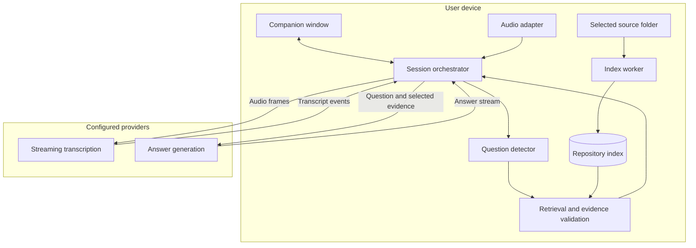

# Codebase Call Copilot

Technical design document · Version 1.0 · September 17, 2026

**Status:** Proposed design for implementation. This document specifies the product and engineering approach; it does not represent an implemented or benchmarked application.

## 1. Purpose

Build a desktop application that listens during a technical call, identifies questions about a selected codebase, retrieves the relevant implementation, and displays a concise answer while the conversation is still happening.

The interaction should resemble a live interview copilot such as Final Round, with repository understanding as its central capability. The intended use is engineering discussions, project handovers, client calls, architecture reviews, and troubleshooting sessions.

The defining requirement is **a useful answer grounded in the actual code, delivered quickly enough to use in conversation**. A transcript, generic coding assistant, or post-meeting summary alone does not satisfy this requirement.

Example questions:

- “Where is authentication enforced for this endpoint?”
- “What happens if the payment webhook arrives twice?”
- “Which WordPress hook triggers this integration?”
- “How does the frontend obtain this data?”
- “What would be affected if we changed this function?”
- “And what happens when that request times out?”

## 2. Scope and design assumptions

The following are proposed defaults, not additional requirements supplied by the user.

| Area | Proposed initial scope |
| --- | --- |
| Platform | macOS first, initially Apple Silicon; exact supported OS versions established by the audio-capture prototype. Keep platform adapters replaceable for Windows later. |
| Meeting software | Validate Zoom desktop, Microsoft Teams desktop, and Google Meet in Chrome. Capture operating-system audio rather than integrate with each meeting service. |
| Repository access | Select an existing local checkout or source folder. Git repositories expose branch, commit, and local-change status. |
| Active context | One active repository per session; a monorepo counts as one repository. Multiple repositories can be registered and indexed. |
| Source support | Text-based source code, project documentation, manifests, tests, migrations, and configuration templates. Structured parsing starts with JavaScript, TypeScript, PHP, and Python; other languages use text retrieval. |
| Speech | English first. Transcription and response language remain configurable for later Spanish and Portuguese support. |
| AI services | User-provided API keys. Cloud transcription and answer generation; local indexing and embeddings by default. |
| Output | Text in an always-on-top companion window, with source references and expandable detail. |
| Initial operating mode | Read-only repository access. Start and stop listening explicitly. Automatic question answering with a manual shortcut as fallback. |

“Any codebase” means the architecture accepts arbitrary supported source folders. It does not imply equal semantic understanding of every language, unlimited repository size, or visibility into production state that is absent from the repository.

### Required for the first usable release

Repository selection and indexing; microphone and call-audio capture; streaming transcription; automatic and manual question triggers; conversation-aware retrieval; streamed answers with citations; index refresh; clear failure states; credential management; and a packaged desktop application.

### Later extensions

GitHub/GitLab/Bitbucket account connections, cross-repository search, multilingual evaluation, locally hosted speech and answer models, ticket and pull-request context, optional saved-session export, and Windows support.

Automatic code changes, production database access, autonomous command execution, and speaking answers into the meeting are outside the initial scope. Screen-share invisibility is not a release requirement and must not be promised without a separately validated platform design.

## 3. User experience

### Before the call

1. Add a repository through the operating-system folder picker.
2. Review the detected branch, included directories, excluded files, and indexing progress.
3. Configure transcription and answer providers, then test connectivity.
4. Select the call-audio source and microphone. Confirm both with independent level meters and a short transcription test.
5. Choose the repository for the session and start listening.

### During the call

The compact window prioritizes the current question and a two- or three-sentence answer. Sources, deeper explanation, and the transcript are secondary panels.

Required controls: start/pause/stop capture; automatic-answer toggle; answer the latest question; edit a detected question; type a question; cancel generation; pin an answer; show sources; and switch repositories.

The window must not steal keyboard focus when an answer arrives. Global shortcuts must be configurable, with conflicts reported. The user must be able to resize the window and increase text size.

Each answer displays the repository and snapshot used. Source selection opens a local code preview with highlighted lines; opening the current file in VS Code is an optional action. If the file has changed, the preview retains the cited snapshot and identifies the difference.

### After the call

Stop capture and close the provider streams. Discard session audio and unsaved transcript/answer state. Keep the repository index for the next session. A later explicit save feature must make session retention a deliberate action.

## 4. Architecture

Use an Electron desktop shell, a React/TypeScript interface, and a TypeScript orchestration layer. Keep CPU-heavy indexing and embedding work in a separate utility process. No hosted application backend is required for the initial personal-use version.



### Component responsibilities

| Component | Responsibility | Proposed implementation |
| --- | --- | --- |
| Desktop shell | Windows, shortcuts, permissions, lifecycle | Electron |
| Presentation | Transcript, question cards, answer stream, source viewer | React + TypeScript |
| Orchestrator | Session state, request IDs, cancellation, provider adapters | TypeScript in the main process; no CPU-intensive parsing |
| Audio adapter | Capture sources, timestamps, conversion, device changes | Electron capture APIs where verified; a native macOS helper if required |
| Index worker | Discovery, parsing, chunking, embeddings, incremental updates | Node utility process with packaged parsing and embedding runtimes |
| Local storage | Repository metadata, versioned chunks, lexical search, vectors | SQLite with FTS5; vector-search implementation selected through a packaging and performance spike |
| Transcription adapter | Streaming speech-to-text and reconnect handling | Deepgram streaming API as the initial candidate |
| Answer adapter | Stream responses from evidence and conversation context | OpenAI Responses API as the initial candidate |
| Credentials | Protect provider API keys | OS credential store; never renderer storage |

Provider and model selection must be configuration, not scattered application logic. Pin tested model identifiers and dependencies at release time.

Use a focused implementation of this architecture. Reusing Glass is an alternative to evaluate for maintenance and license implications, not a prerequisite or an assumed existing integration.

## 5. Audio capture and transcription

### Capture model

Capture remote call audio and the user's microphone as separate logical sources. Preserve source labels and monotonic timestamps before transcription. Separate sources distinguish “me” from “call”; they do not identify individual remote participants.

Headphones must work. Microphone-only recording of loudspeaker playback does not meet the requirement. Capture must never monitor its output back into the meeting. Prefer capture restricted to the selected meeting application when the platform supports it; otherwise clearly identify that system output is being captured.

Normalize audio to a provider-supported PCM format in the adapter. Start with 20–100 ms frame batches and a bounded in-memory queue; tune during testing. Keep raw audio transient and do not create recordings by default.

Audio capture is an early engineering gate. Electron documents platform-specific behavior, macOS permission requirements, and circumstances in which a dead audio stream may be returned without an error. Validate the packaged app and actual audio samples, rather than treating a resolved capture request as success. [Electron desktop capture documentation](https://www.electronjs.org/docs/latest/api/desktop-capturer)

### Transcript assembly

The transcription adapter emits normalized partial, final-segment, turn-end, and connection-state events. Interim text updates the UI and may warm retrieval, but only finalized text enters the durable in-memory conversation buffer.

For the proposed Deepgram adapter, accumulate finalized segments and distinguish segment finalization from a pause marking an utterance boundary. Its API exposes these separately through `is_final` and `speech_final`. [Deepgram endpointing and interim results](https://developers.deepgram.com/docs/understand-endpointing-interim-results)

Provider endpointing is one input to question detection, not proof that a complete question has been asked. Begin with a 400–700 ms post-pause debounce, retaining continuation text. This is a tunable application default.

Handle reconnects using a new stream epoch plus event sequence IDs. Do not replay old audio automatically after a prolonged outage. Discard the bounded unsent queue, mark a transcript gap, and resume with current audio. Surface silence, missing permissions, and disconnected devices separately from network failure.

## 6. Repository ingestion and index lifecycle

### Discovery and boundaries

Resolve the selected root to a canonical path and keep all reads inside that boundary. Ignore symlinks by default. Honor nested Git ignore rules and a project-specific `.callcopilotignore` file.

Exclude dependency folders, generated bundles, binaries, caches, media, private keys, credential files, `.env` variants, and known secret-bearing configurations by default. Include source, tests, schemas, manifests, and documentation. Allow explicit dependency-source inclusion for questions that require it. Show excluded files and reasons; never silently describe an incomplete index as complete.

Apply a content-based secret filter before storing or sending chunks. Pattern filtering reduces exposure but cannot guarantee detection of every secret. Preserve line numbering when redacting. Source exclusions apply before embeddings are computed.

Do not run repository scripts, package hooks, builds, or instructions found in source files. Framework detection should read manifests and conventions without executing the project.

### Parsing and chunks

Parse supported languages into function, method, class, and module boundaries. Preserve imports and nearby declarations as metadata. Tree-sitter is the proposed syntax layer because it supports incremental parsing and has parsers for the initial languages. [Tree-sitter documentation](https://tree-sitter.github.io/tree-sitter/)

For unsupported languages or parse failures, fall back to overlapping line-based chunks. Start with approximately 400–900 tokens per chunk and a bounded overlap for oversized blocks. Documentation is chunked by headings. These sizes require retrieval evaluation before release.

Each chunk records repository ID, index generation, relative path, file content hash, line range, language, symbol names, text, and parser/model versions. Convert parser offsets into correct user-visible line numbers for CRLF and Unicode files.

### Search indexes

Maintain both lexical and semantic indexes. Lexical search handles exact identifiers and paths; semantic search connects natural-language questions to code using different vocabulary.

SQLite FTS5 supplies full-text indexing and BM25 ranking. Store original identifiers alongside split forms, so `processWebhook`, `process_webhook`, and spoken “process webhook” can be found without losing exact-match signals. [SQLite FTS5 documentation](https://www.sqlite.org/fts5.html)

Generate embeddings locally with a pinned model. Record its identifier, checksum, dimensions, and preprocessing version. Store vectors against chunk IDs. Benchmark an embedded vector-search implementation; a bounded exact-vector scan is acceptable only if it meets the agreed corpus and latency targets. Do not assume FTS5 itself provides vector search.

No repository-wide cloud embedding upload occurs in the default design. A later cloud indexing or embedding mode must be an explicit configuration change with different data handling documented.

### Updates and snapshots

Watch file changes, debounce bursts, and reindex only changed files. Remove deleted files from both search indexes. Use a worker queue with bounded concurrency; give active-call retrieval priority over background embedding jobs.

Publish each index generation atomically. A generation is an immutable manifest mapping files to their indexed content hashes. It may reference unchanged chunks from earlier generations. It is not a guarantee of a filesystem-wide atomic snapshot; changed files must be revalidated during ingestion.

Every question binds to one committed index generation. For Git repositories, attach branch, HEAD commit, and dirty-working-tree status. A branch change cancels pending retrieval, marks the index as refreshing, and prevents new answers from mixing the previous branch with the new one. During ordinary edits, answers may use the last complete generation if its age and pending changes are visible.

Cache keys include repository ID, generation, query, embedding version, and answer configuration. A changed generation invalidates answer reuse. Retain chunks needed by visible answer cards until the session ends.

## 7. Question detection and conversation context

The detector must recognize direct questions, requests such as “walk me through this flow,” and short follow-ups such as “why?” or “what about retries?”

Use two stages:

1. A local candidate filter uses finalized turns, source, timing, interrogative phrases, and technical terms. It filters obvious acknowledgments and duplicate transcripts.
2. A small configurable model classifies ambiguous candidates and rewrites accepted questions into a standalone retrieval query. It receives a bounded conversation window and relevant symbol vocabulary, not the full repository.

Keep approximately the last three minutes of finalized dialogue plus the current topic and recent question/answer references. The bound is configurable. Maintain the original wording alongside the rewritten query so transcription corrections remain visible.

Automatic triggers default to remote-call speech. The user's microphone supplies context but does not automatically answer every sentence the user speaks. Manual ask always works on selected text or a typed question.

Deduplicate equivalent questions within a short window, but treat materially changed conditions as a new question. A request asking several things becomes one card with its subquestions preserved.

A high-confidence partial transcript may start speculative local retrieval. Do not generate repeated paid answers on every transcript revision. A finalized question commits the request; a later correction creates a new revision and invalidates work for the old one.

## 8. Retrieval and answer generation

### Retrieval pipeline

1. Combine the question with resolved references from recent conversation and the selected repository scope.
2. Search exact identifiers/paths, BM25 results, and semantic neighbors in parallel within the same index generation.
3. Merge candidate lists by rank, remove overlapping chunks, and prioritize implementation evidence over broad documentation when behavior is being asked about.
4. Expand one bounded step into imports, referenced definitions, callers, configuration, and tests where those relationships are actually indexed.
5. Assemble an evidence pack containing roughly 8–12 chunks within an initial 10,000-token evidence budget. Adapt the budget to the selected model and latency target.
6. If evidence is insufficient, perform at most one bounded search expansion. Otherwise return a partial answer or a clear “not established from this repository” result.

A lightweight relation index supports navigation; it is not a complete runtime call graph. Dynamic dispatch, reflection, runtime configuration, WordPress hook registration, and dependency behavior can limit static conclusions. Tests show intended or tested behavior, not proof of production execution.

### Evidence pack

Assign a request-local source ID to every selected excerpt. Include its relative path, exact lines, symbol, hash, and generation. The model cites these IDs rather than inventing file paths. Source cards are generated from application metadata.

Validate all cited IDs against the supplied evidence pack. Do not label an answer “verified” just because its citations resolve. File integrity can be checked mechanically; semantic support requires answer evaluation.

### Answer contract

The response has four ordered parts:

| Part | Behavior |
| --- | --- |
| Short answer | Two or three direct sentences, usually under 80 words, suitable for reading during the call. |
| Evidence | Source IDs attached to implementation-specific claims; clicking opens the captured excerpt. |
| Detail | Optional explanation of the flow, relevant conditions, and tradeoffs. |
| Limitations | Explicitly identify assumptions, missing configuration, external services, and unresolved behavior. |

Require a distinction between observed implementation, reasonable inference, and general engineering advice. An empty search result must not become a confident answer based on general knowledge. If the question is ambiguous, show a clarification suggestion or state the interpretation used.

Treat transcript text and repository contents as untrusted evidence. They cannot override application instructions, request credentials, change repository scope, or trigger tools. The answer service has no shell or write capability.

Use streaming generation so text appears progressively. OpenAI's Responses API exposes typed streaming events, including `response.output_text.delta` and completion events, which an adapter can map to the internal event contract. [OpenAI streaming responses documentation](https://developers.openai.com/api/docs/guides/streaming-responses)

Use one generation for the short answer and supporting detail. Sources can be validated as complete citation markers arrive; unresolved markers stay non-clickable and are flagged at completion. Do not delay the entire answer for a separate second-generation validation call.

### Request concurrency

Allow one active answer stream and a small visible pending queue. Preserve distinct questions instead of silently discarding them. A corrected version of the same question supersedes its older request; an unrelated question receives its own card.

Manual requests receive priority. Pinning an answer prevents the view from automatically switching away from it. Every stream event carries a request ID and question revision; events from canceled, superseded, or wrong-repository requests are discarded.

## 9. Internal interfaces and state

These are design contracts, not application implementation.

| Interface | Main operations | Required behavior |
| --- | --- | --- |
| `AudioSourceAdapter` | `listSources`, `start`, `pause`, `stop` | Emits timestamped frames and source-health events. |
| `TranscriptionProvider` | `connect`, `sendAudio`, `close` | Emits revisions, final segments, turn boundaries, and errors. |
| `RepositoryIndexer` | `register`, `index`, `refresh`, `remove` | Emits progress and atomically publishes a generation. |
| `QuestionDetector` | `observeTurn`, `askManually`, `reset` | Emits accepted questions with original text, query, and revision. |
| `CodeRetriever` | `search`, `expand`, `readEvidence` | Returns only evidence from the requested repository and generation. |
| `AnswerProvider` | `streamAnswer`, `cancel` | Streams text, source IDs, terminal status, and available usage data. |

Core event envelope:

```typescript
type EventEnvelope<T> = {
  eventId: string;
  sessionId: string;
  requestId?: string;
  questionRevision?: number;
  repositoryId?: string;
  indexGeneration?: string;
  timestampMs: number;
  type: string;
  payload: T;
};
```

Required event types include `capture.status`, `transcript.partial`, `transcript.final`, `question.accepted`, `index.progress`, `index.ready`, `answer.sources`, `answer.delta`, `answer.completed`, `answer.canceled`, and `operation.failed`.

Use explicit terminal events so “finished,” “canceled,” and “failed after partial output” cannot be confused. IPC payloads must be validated, size-limited, and scoped to approved operations. The renderer never receives arbitrary filesystem or shell access.

Session states: `idle`, `checking`, `listening`, `paused`, `reconnecting`, and `stopped`. Index and answer states are separate state machines, allowing typed questions to work when audio is unavailable.

## 10. Storage and data handling

### Logical data model

| Entity | Essential fields | Default retention |
| --- | --- | --- |
| Repository | ID, canonical root, display name, ignore policy | Until removed |
| Index generation | ID, repository ID, branch/commit when available, dirty flag, manifest, versions | Current plus snapshots referenced by the session |
| File/chunk | Hash, relative path, text, lines, symbols, language | While referenced by an index or active answer |
| Embedding | Chunk ID, model version, dimensions, vector | With its chunk/model generation |
| Session | ID, repository ID, settings, lifecycle timestamps | Memory only |
| Transcript segment | Source, stream epoch, sequence, text, timing, revision | Memory only |
| Question/answer | Query, revision, snapshot, text, source IDs, status | Memory only |
| Credential reference | Provider and OS credential-store lookup key | Until removed |

Persist indexes in the user's application-data directory with restrictive filesystem permissions. Keep raw credentials in the OS credential store. App-level encryption of the code index is a separate design decision; do not describe ordinary SQLite storage as encrypted. Repository indexes contain copies of source code and must be treated accordingly.

### External data boundary

| Destination | Data sent in the default design |
| --- | --- |
| Speech provider | Audio from sources explicitly enabled during the session |
| Question/answer provider | Bounded transcript context, questions, relevant symbol vocabulary, and retrieved code excerpts |
| Embedding provider | None; embeddings run locally |
| Application backend | None in the initial design |

Show these choices during provider setup. Configure provider-side storage options deliberately and document the selected account's retention settings. Local deletion cannot promise deletion from a provider's independent logs.

Logs contain timing, error codes, provider/model IDs, and aggregate usage by default. Exclude transcript text, source excerpts, raw audio, and keys. Diagnostic content capture requires an explicit user action and has a defined deletion path.

## 11. Performance and cost targets

All numbers below are proposed acceptance targets, not observed performance or provider guarantees.

Reference test environment: an Apple Silicon Mac with 16 GB RAM, a warm index, a stable network, and a corpus of up to 10,000 included text files or 1 million source lines, whichever limit is reached first. Initial indexing uses a separate benchmark. Larger repositories must show coverage and resource limits instead of silently truncating.

| Metric | Proposed target |
| --- | --- |
| First useful short-answer text | Median at most 2.5 seconds; p95 at most 5 seconds after the speaker finishes the question |
| Complete short answer with source references | p95 at most 10 seconds |
| Local retrieval after query acceptance | p95 at most 500 ms on the reference corpus |
| Small-file index refresh | p95 at most 5 seconds after the file settles, outside bulk changes |
| Warm application readiness | Repository can be queried without re-embedding unchanged files |
| Pause/stop responsiveness | Stop enqueueing new audio immediately; release capture resources within 1 second under normal conditions |
| Session reliability | 60-minute supported-call test without a capture crash or unbounded queue/memory growth |

Measure the first useful answer as the first complete, relevant clause, not the first token or a “thinking” message. The end-to-end measurement includes speech finalization, question detection, retrieval, and model generation. Use both real provider calls and deterministic replay; report the hardware, models, corpus, network conditions, and error rate with results.

Keep models loaded and provider connections warm only during an active session. Cache local retrieval by generation. Bound context and output tokens. Limit classifier calls to plausible turns and generation calls to accepted questions.

Track transcription duration per source and answer-model token usage. Display estimated session cost only when current pricing is configured; do not fabricate a cost if usage or rates are unavailable. Rate limits should reduce automatic requests while preserving an explicit retry path.

## 12. Failure handling

| Condition | Required application behavior |
| --- | --- |
| Call audio absent | Show a failed call-audio check; allow an explicitly labeled microphone-only mode. |
| Microphone permission denied | Explain the unavailable source; remote-call capture may continue if healthy. |
| Device changes or sleep/wake | Revalidate capture sources and provider streams before claiming listening has resumed. |
| Network disconnect | Mark a transcript gap, reconnect with bounded backoff, and avoid stale-audio replay. |
| Invalid key or exhausted quota | Identify the failing service and stop automatic retries that cannot succeed. |
| Repository unavailable | Retain existing labeled answer cards; block new repository answers until scope is valid. |
| Branch switch | Cancel stale requests and wait for a generation representing the new branch. |
| No relevant evidence | State that the answer is not established and show what additional context is needed. |
| Model stream fails midway | Mark the visible answer incomplete and offer retry without hiding the partial result. |
| File moved after answering | Open the captured excerpt; indicate that the current file has changed or disappeared. |
| Embedding worker fails | Enter clearly labeled lexical-only retrieval; automatic answers require an explicit degraded-mode choice. |

## 13. Validation and release criteria

Use a small maintained evaluation corpus representing at least a PHP/WordPress application, a TypeScript application, and a Python service. Add a language without structured parsing to test fallback behavior. Each repository needs answerable questions with known supporting evidence, follow-up questions, and deliberately unanswerable questions.

Initial quality targets: relevant supporting evidence in the top ten retrieved chunks for at least 90% of answerable evaluation questions; at least 90% of reviewed answers materially supported by their cited evidence; and at least 90% of unanswerable questions clearly identifying the missing evidence. Establish a minimum 100-question held-out set and keep development examples separate. These are proposed gates, not proof of universal reliability.

| ID | Acceptance scenario |
| --- | --- |
| AC-01 | A new local repository indexes with visible coverage, excludes configured secrets/dependencies, and can answer a typed implementation question. |
| AC-02 | A question spoken by a remote participant is captured while the user wears headphones and automatically produces a grounded answer. |
| AC-03 | A short follow-up resolves its subject from the preceding exchange without switching repositories or inventing context. |
| AC-04 | Duplicate transcript events produce one question; a correction supersedes the earlier answer request. |
| AC-05 | Every rendered citation resolves to the exact supplied excerpt and generation, including after local edits. |
| AC-06 | A branch switch cannot combine old-branch evidence with new-branch metadata. |
| AC-07 | An unavailable answer is identified as unsupported rather than filled in from general programming knowledge. |
| AC-08 | Pausing capture stops new audio transmission; stopping closes streams and clears unsaved session state. |
| AC-09 | Provider failures, lost connectivity, and missing permissions produce visible recoverable states. |
| AC-10 | The packaged application meets the agreed latency and 60-minute call reliability targets on the supported meeting matrix. |
| AC-11 | Repository text containing hostile instructions cannot invoke commands, expose keys, or change application settings. |
| AC-12 | API keys and repository contents do not appear in default logs, exported diagnostics, or renderer persistence. |

Measure question-detection precision and recall separately from answer quality. Proposed starting gates are 90% precision and 85% recall on labeled conversation replays. Include pauses inside questions, multi-part questions, quoted questions, background conversation, and acoustic echo. If automatic mode is noisy, improve detection before broadening the trigger policy.

## 14. Implementation sequence

| Phase | Deliverable | Exit condition |
| --- | --- | --- |
| 0. Technical spikes | Packaged macOS capture test; local parser/embedding/vector packaging test | Confirm supported OS/device matrix and viable native dependencies. |
| 1. Repository Q&A | Folder picker, versioned local index, typed questions, streamed answers, source viewer | Retrieval and source-integrity tests pass on the evaluation repositories. |
| 2. Live transcript | Independent sources, provider adapter, transcript assembly, permission diagnostics | Headphone and 60-minute capture tests pass. |
| 3. Live answers | Question detection, follow-up context, cancellation, pending queue, compact window | Live end-to-end acceptance and latency gates pass. |
| 4. Release hardening | Credential storage, recovery, packaging, signing/notarization, usage reporting | Installable build passes the supported meeting matrix. |
| 5. Expansion | Additional providers, languages, operating systems, and cross-repository context | Each extension receives its own compatibility and quality evaluation. |

No duration or budget is committed by this document. Audio compatibility and local embedding performance are the first uncertainties to resolve.

## 15. Decisions to settle before implementation

| Decision | Recommended starting point | Why it remains open |
| --- | --- | --- |
| Exact macOS baseline and Intel support | Apple Silicon first; select OS baseline after capture spike | Native capture behavior and packaged dependencies must be tested together. |
| Speech provider/model | Deepgram streaming adapter | Confirm vocabulary accuracy, endpointing, cost, and account availability. |
| Answer and question models | Configurable OpenAI Responses models | Select against latency and evidence quality rather than a model name alone. |
| Local embedding model and vector backend | Packaged local model plus embedded search | Confirm license, download size, RAM, retrieval quality, and build compatibility. |
| Storage encryption requirements | OS credentials; explicit treatment of local source indexes | Client or employer constraints may require app-level encryption or fully local inference. |
| First repository used for validation | A representative real project with permission to process its code | Ground truth must reflect the user's actual questions and stack. |
| Future distribution | Personal desktop tool initially | Team accounts, billing, centralized storage, and update infrastructure change the architecture. |

The first complete release is successful when the user can select a repository, join a supported call, hear a technical question, and receive a concise answer with inspectable code evidence before the discussion moves on.
